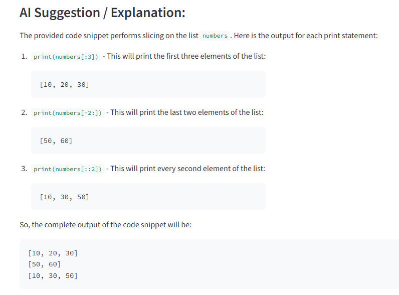

# AI Code Assistant with RAG 🚀

A Streamlit-powered application that uses Retrieval-Augmented Generation (RAG) to provide intelligent answers and suggestions for your code snippets. By combining a Large Language Model (LLM) with a FAISS vector store, the assistant provides context-aware insights based on provided documentation.

## ✨ Features
- **Code Analysis:** Paste code and ask specific questions.
- **RAG Integration:** Uses vector search to retrieve relevant documentation context before answering.
- **Interactive UI:** Clean Streamlit interface with syntax highlighting.
- **Customizable:** Easily swap out models or document sources.

---

## 🛠️ Installation

1. **Clone the repository:**
   ```bash
   git clone [https://github.com/yourusername/ai-code-assistant.git](https://github.com/yourusername/ai-code-assistant.git)
   cd ai-code-assistant

```

2. **Install dependencies:**
Make sure you have Python installed, then run:
```bash
pip install -r requirements.txt

```


3. **Set up Environment Variables:**
Create a `.env` file in the root directory and add your API keys (e.g., OpenAI):
```env
OPENAI_API_KEY=your_api_key_here

```

---

## 🚀 Usage

1. **Run the Streamlit app:**
```bash
streamlit run app.py

```

2. **In the browser:**
* Paste your **code snippet** in the text area.
* Enter your **question** about the code.
* Click **"Analyze Code with RAG"**.
* View the AI suggestions and the sources used for the answer.

3. **Demo**

numbers = [10, 20, 30, 40, 50, 60]

print(numbers[:3]) 
print(numbers[-2:]) 
print(numbers[::2])


---

## 📂 Project Structure

```text
├── app.py           # Streamlit frontend & user input handling
├── rag_helper.py    # RAG utilities: vectorstore & AI query logic
├── requirements.txt # Python dependencies
└── README.md        # Project documentation

```

### Module Breakdown

* **`app.py`**: The main entry point. Handles the UI, captures user input, and manages the orchestration between the user and the RAG logic.
* **`rag_helper.py`**:
* Initializes embeddings and the **FAISS** vector store.
* `create_vectorstore(docs)`: Converts document objects into a searchable vector database.
* `ask_rag(...)`: Performs the retrieval and sends the augmented prompt to the LLM (default: `gpt-4o-mini`).


---

## ⚙️ Customization

* **Add More Documents:** Extend the `docs` list in `app.py` with your own project-specific documentation.
* **Change LLM Model:** Modify the `model` parameter in `rag_helper.py` to use different versions or providers.
* **Adjust Search Precision:** In `rag_helper.py`, change the `k` value in `vectorstore.similarity_search(query_text, k=3)` to retrieve more or fewer context snippets.

---

